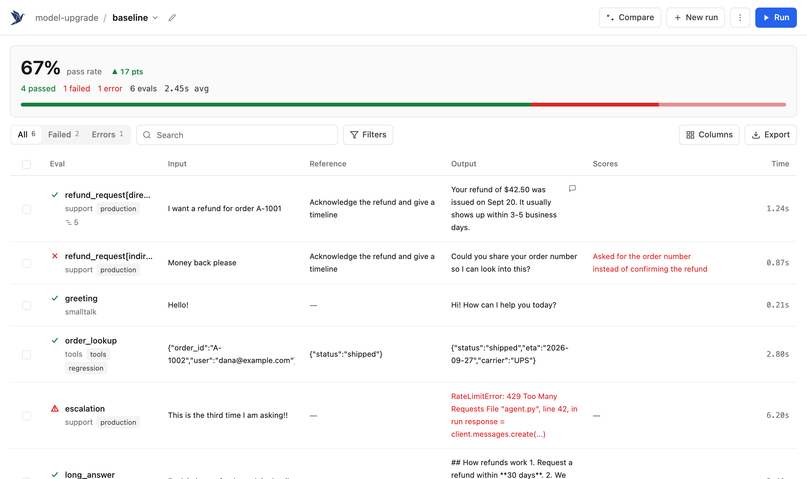

# EZVals

Unit testing for AI agents and LLM apps. Write evals like tests, in Python or TypeScript; EZVals runs them, stores every result, and gives you a web UI to review, annotate and compare runs.



## Install

EZVals is a development dependency.

```bash
uv add --dev ezvals          # or: pip install ezvals
npm install --save-dev ezvals  # TypeScript (Node >= 22.18)
```

## Write an eval

```python
# evals/support.py
from ezvals import eval, EvalContext

@eval(input="I want a refund", dataset="customer_service")
async def test_refund(ctx: EvalContext):
    ctx.output = await run_agent(ctx.input)
    assert "refund" in ctx.output.lower(), "Should acknowledge refund"
```

```ts
// evals/support.eval.ts
import assert from "node:assert";
import { evaluate } from "ezvals";

evaluate("refund", { input: "I want a refund", dataset: "customer_service" }, async (ctx) => {
  ctx.output = await runAgent(ctx.input);
  assert(String(ctx.output).toLowerCase().includes("refund"), "Should acknowledge refund");
});
```

A failed assertion is a failing score, not an error, and whatever the eval stored before it is kept. Use `cases=` to run one eval over many inputs, `ctx.store(scores=...)` for named or numeric scores, and `target=` to separate calling your agent from scoring it. See the [docs](docs/) and [examples](examples/).

## Run it

```bash
ezvals run evals/                  # headless; saves to .ezvals/sessions/
ezvals run evals/ --json           # ...and print the results as JSON (handy for agents)
ezvals serve evals/                # web UI: run, filter, annotate, compare runs
ezvals run evals/support.py::test_refund -c 8 --timeout 30
```

TypeScript projects run the same commands through `npx ezvals`. A directory with both languages runs as one.

## Agent skill

EZVals ships a skill that teaches coding agents to write and analyze evals:

```bash
ezvals skills add --claude   # or --codex, --cursor, --windsurf, --kiro, --roo, --agents
```

## How it works

`ezvals` is a single Go binary (`cmd/ezvals/`) that owns the CLI, the web UI (`ui/`, embedded at build time) and storage. To run evals it spawns a small worker from the language SDK (`python/`, `typescript/`) that imports your files and executes evals on request; results stream back and are appended to a per-run event log. Adding a language means writing an SDK against [the SDK spec](docs/.spec/EXPERIENCE_SPEC_SDK.md) and passing the shared `conformance/` fixtures.

## Development

Requires Go, Node, and uv.

```bash
make build                         # UI + host binary (into python/ezvals/bin) + TypeScript SDK
make test                          # Go (incl. cross-language conformance), Python and TypeScript tests
make test-e2e                      # browser tests for the web UI
uv run --project python ezvals serve examples
```

Specs in `docs/.spec/` are the source of truth for behavior.
