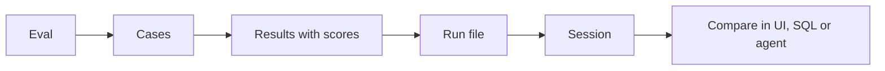

Read this once and the rest of the docs will make sense: everything in EZVals is one of six ideas.

## Eval

An **eval** is a function marked with `@eval` in Python or registered with `evaluate()` in TypeScript. It gets an `EvalContext` (`ctx`) that already holds its `input` and `reference`. It calls your agent, sets `ctx.output`, and checks it. When the function returns, the context becomes a **result**.

An eval also carries a `dataset` (the file name by default) and optional `labels`. You can use both to filter what runs and what you see.

## Cases

One eval function can expand into many **cases**, one per row of test data. Each case has its own input and reference, and each one becomes a separate result with an id like `test_sentiment[pos]`. Use cases when many inputs share the same logic. Write separate evals when the checks differ. See [Cases](/writing-evals/cases).

## Scores

A result holds one or more **scores**. A score has a `key`, and a `passed` boolean, a numeric `value`, or both, plus optional `notes`. A failed `assert` becomes a failing score, and a clean finish with no explicit score counts as a pass. A result **passes** when it has no error, has at least one pass/fail score, and all of its pass/fail scores passed. See [Scoring](/writing-evals/scoring).

## Run

A **run** is one execution of a set of evals. `ezvals run` or the Run button in the UI starts one. The `ezvals` binary starts fresh Python and Node worker processes for each run, so your latest code is always what runs. Each run gets an 8-character id and a name, and is saved as one file, `.ezvals/sessions/<session>/<run_id>.jsonl`.

A run can go further than a single pass:

- **[Trials](/writing-evals/trials)** run each eval several times and report pass@k and pass^k.
- **[Regrading](/writing-evals/targets-and-regrading)** scores a finished run's stored outputs again with your current grading code.
- **[Tracing](/writing-evals/tracing)** records every OpenTelemetry span your agent emitted during each eval.

## Session

A **session** is a named group of runs, stored as a folder under `.ezvals/sessions/`. Put the runs you want to compare in the same session: a baseline and a candidate, one run per model, or a series of attempts at a fix. See [Sessions & comparing runs](/reviewing/sessions).

## Compare

Compare runs to answer the question the eval was written for. You can:

- Open up to four runs side by side in the [web UI](/reviewing/web-ui).
- Ask across every saved run with [SQL](/reviewing/querying).
- Hand the run JSON to your coding agent.

