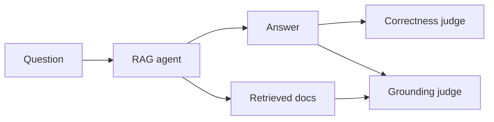

A RAG agent can fail in two ways: it gives the wrong answer, or it gives the right-sounding answer without support in what it retrieved. This recipe scores both across a list of question and answer pairs.



## The eval

<CodeGroup>

```python Python
from ezvals import eval, EvalContext

async def run_agent(ctx: EvalContext):
    result = await rag_agent(ctx.input)
    ctx.store(output=result.answer, metadata={"source_docs": result.docs})

@eval(
    target=run_agent,
    dataset="rag_qa",
    cases=[
        {"input": "What is our refund policy?", "reference": "30-day money-back guarantee"},
        {"input": "How do I reset my password?", "reference": "Click 'Forgot password' on the login page"},
        {"input": "How long does shipping take?", "reference": "3-5 business days"},
    ],
)
async def test_rag(ctx: EvalContext):
    grounded, why = await grounding_judge(ctx.output, ctx.metadata["source_docs"])
    correct, reason = await correctness_judge(ctx.output, ctx.reference)
    ctx.store(scores=[
        {"key": "grounded", "passed": grounded, "notes": why},
        {"key": "correct", "passed": correct, "notes": reason},
    ])
```

```ts TypeScript
import { evaluate, type EvalContext } from "ezvals";

async function runAgent(ctx: EvalContext) {
  const result = await ragAgent(String(ctx.input));
  ctx.store({ output: result.answer, metadata: { source_docs: result.docs } });
}

evaluate("test_rag", {
  target: runAgent,
  dataset: "rag_qa",
  cases: [
    { input: "What is our refund policy?", reference: "30-day money-back guarantee" },
    { input: "How do I reset my password?", reference: "Click 'Forgot password' on the login page" },
    { input: "How long does shipping take?", reference: "3-5 business days" },
  ],
}, async (ctx) => {
  const grounding = await groundingJudge(ctx.output, ctx.metadata.source_docs);
  const correctness = await correctnessJudge(ctx.output, ctx.reference);
  ctx.store({
    scores: [
      { key: "grounded", passed: grounding.passed, notes: grounding.why },
      { key: "correct", passed: correctness.passed, notes: correctness.reason },
    ],
  });
});
```

</CodeGroup>

`grounding_judge` and `correctness_judge` stand in for your own LLM calls. See [LLM judge](/recipes/llm-judge) for how to write and calibrate them.

## Why it's built this way

- **Cases** turn a list of questions into one result each. Real suites often have hundreds, which you can load from a file with an [input loader](/writing-evals/cases#load-cases-at-discovery-time).
- **The target** calls the agent and keeps the retrieved documents in `metadata`. They show up next to each result in the web UI, so when an answer is wrong you can see straight away whether retrieval or generation failed.
- **Two named scores** keep the failure modes apart. The summary shows a bar for each, so "grounding dropped, correctness held" is visible at a glance.
- Because the agent call is in a target, you can change either judge and [regrade](/writing-evals/targets-and-regrading#regrading) without querying the agent again.

## Run it

```bash
ezvals run evals/rag.py            # or evals/rag.eval.ts
ezvals serve evals/rag.py          # review the answers in the browser
```

Ask your coding agent to look at the failures: "Which questions failed grounding, and what did retrieval return for them?"
